#* Science is Shaped by Wikipedia:   Evidence From a Randomized Control Trial

[Neil C. Thompson](mailto:neil_t@mit.edu)
MIT  Sloan School of Management
MIT Computer Science and Artificial Intelligence Lab

[Douglas Hanley](mailto:doughanley@pitt.edu)
University of Pittsburgh

 

**Abstract**

*"I sometimes think that general and popular treatises are almost as important for the progress of science as original work." — Charles Darwin, 1865*

As the largest encyclopedia in the world, it is not surprising that Wikipedia *reflects* the state of scientific knowledge. However, Wikipedia is also one of the most accessed websites in the world, including by scientists, which suggests that it also has the potential to *shape* science. This paper shows that it does.

Incorporating ideas into a Wikipedia article leads to those ideas being used more in the scientific literature. This paper documents this in two ways: correlationally across thousands of articles in Wikipedia and causally through a randomized control trial where we add new scientific content to Wikipedia. We find that the causal impact is strong, with Wikipedia influencing roughly one in every three hundred words in related scientific journal articles.

Our findings speak not only to the influence of Wikipedia, but more broadly to the influence of repositories of scientific knowledge. The results suggest that increased provision of information in accessible repositories is a cost-effective way to advance science. We also find that such gains are equity-improving, disproportionately benefitting those without traditional access to scientific information.

*JEL Codes:* O31, O33, O32

 

# Introduction

In a letter to fellow biologist T.H. Huxley in 1865, Charles Darwin wrote "I sometimes think that general and popular treatises are almost as important for the progress of science as original work" (@[lightman-science], p 355). And, tellingly, *On the Origin of Species* was both a seminal scientific work and a bestseller (@[darwin]).

This paper asks whether "general and popular treatises" themselves feed back into science and help shape it. Rephrasing this into the language of economics, we ask whether the provision of known scientific knowledge in an open, accessible repository can shape the scientific discussion of those ideas — and, in particular, whether Wikipedia already does. This is an important public policy question because it has been known since at least @[samuelson-public] that public goods, of which public repositories of knowledge are a good example, are underprovisioned in a market setting. They are thus good candidates for welfare-improving interventions by governments, organizations, and public-spirited individuals.

Governments already embrace the role of providing public goods for science in a number of contexts by funding scientific repositories.  These include repositories of physical objects, like seed banks (@[ncgrp]) and model organism repositories (@[mmrrc]), and there is good evidence that this promotes scientific activity (@[stern-giants]). Governments also fund some informational repositories, for example those related to the human genome project (@[nih-research]). Many repositories are also run by organizations or individuals. For example, StackOverflow.com, is widely used question-and-answer repository for knowledge about computer programming.

Conversely, the most extensive repositories of scientific knowledge — academic journals — remain overwhelmingly financed by subscription fees, thereby restricting access. But what if many of the key insights from those journal articles were also available in an easily accessible public repository?

Wikipedia is one of the largest informational public goods providers for science. It is freely available, easily accessible, and is the 5th most visited website in the world (@[alexa-ranking]).  A wide variety of scientific topics are covered on Wikipedia, and a substantial fraction of Wikipedia articles are on scientific topics. Depending on the definition and methods used, Wikipedia has 0.5-1.0 million scientific articles, representing one article for every ~120 scientific journal articles. The scientific sophistication of these articles can be substantial. Based on spot testing in Chemistry, we find that Wikipedia covers more than 90% of the topics discussed at the undergraduate level at top-tier research universities, and about half of those covered at the introductory graduate level.

Given this extensive coverage, it is clear that Wikipedia reflects science. But does it also shape science? Do scientists read Wikipedia articles and encounter news ideas? Or perhaps scientists encounter ideas on Wikipedia that they are already aware of, but which are brought together in a way that influences how they think about them? One could imagine, for example, that in a broad academic field, a concept from one part of the literature might not have been encountered by people from another until it is seen on Wikipedia. ^[This happened to one of the authors (Thompson) with regard to the *many* flavors of t-tests. He was reminded of the panoply [here](https://en.wikipedia.org/wiki/Student's_t-test).] A further possibility is that a scientist could lack access to costly journals, and thus the appearance of an idea on Wikipedia could be that person's only access to that scientific knowledge.

To assess the influence of Wikipedia we need a way to measure the impact that it is having on the academic literature. Traditionally, the most common way of measuring this would be to count academic citations, the acknowledgements that the scientists themselves make in their publications. Unfortunately, measuring the impact of Wikipedia using citations is difficult for two reasons. First, purported experts might be reluctant to admit that they referenced an encyclopedia for their knowledge, and thus not cite Wikipedia even if they used it. Indeed, university guidelines specifically discourage the citation of Wikipedia, as MIT citation guidelines make clear (@[mit-sources]):

"***Wikipedia is Not a Reliable Academic Source***
*Many of us use Wikipedia as a source of information when we want a quick explanation of something. However, Wikipedia or other wikis, collaborative information sites contributed to by a variety of people, are not considered reliable sources for academic citation, and you should not use them as sources in an academic paper.*"

A second challenge to measuring the impact of Wikipedia with citations is that, even if an author were willing to cite an encyclopedia, they might not feel a need to. As Princeton's Academic Integrity Statement advises (@[princeton-sources]):

"*If the fact or information is generally known and accepted—for example, that Woodrow Wilson served as president of both Princeton University and the United States, or that Avogadro's number is $6.02 \times 10^{23}$—you do not need to cite a source*"

It is quite plausible that a researcher, finding that a fact is present in an encyclopaedia, might conclude that the fact is "generally known" and therefore would not feel obliged to cite it. Together, these challenges suggest that citations will not be an accurate way to assess Wikipedia's impact.

We measure the impact of Wikipedia on academic science in two ways: (i) a Big Data approach, and (ii) an experimental approach. Our Big Data approach identifies word-usage in Wikipedia and looks for similar patterns in the full text of academic journal articles. We do this using a full edit-history of Wikipedia (20 terabytes) and full-text versions of every article from 1995 onward from more than 2,000 Elsevier academic journals (0.6 terabytes). This allows us to look at the addition of *any* Wikipedia article and to ask if afterwards the prose in the scientific literature echoes the Wikipedia article's. The advantage of this approach is that we can look very broadly across Wikipedia articles. The disadvantage is that our results are only correlational; they cannot establish causality. This is an important weakness since it cannot rule out the plausible alternatives. Of particular worry is the risk that the correlation comes from mutual causation. In this case, that a breakthrough scientific article would generate both a Wikipedia article and follow-on articles in the scientific literature. This would induce a correlation between Wikipedia and the follow-on articles, but it would *not* indicate that it is Wikipedia that is *shaping* science. It seems obvious that this mechanism is occurring. The interesting question thus becomes if there is an additional impact that Wikipedia itself is causing.

To establish the *causal* impact of Wikipedia, we performed an experiment. We commissioned subject matter experts to create new Wikipedia articles on scientific topics not covered in Wikipedia.  These newly-created articles were randomized, with half being added to Wikipedia and half being held back as a control group. ^[Note: *both* sets of articles need to be written, since the analysis is lexical, and thus the wording of the control articles is important.] If Wikipedia shapes the scientific literature, then the text from the treatment group articles should appear more often in the scientific literature than the text from the control articles. We find exactly that; the word-usage patterns from the treatment group show up more in the prose in the scientific literature than do those from the control group. Moreover, we find that these causal effects are large, and that they are equity-improving (benefiting disproportionately those who are less likely to have access to academic journals with fees).

# Public Goods in Science

The underprovision problem of public goods is a well-researched topic.  Since at least @[samuelson-public], it has been known that private incentives are less than the welfare-maximizing level because they fail to capture the spillover benefits to others. Under these conditions, there is underprovision of the public good absent intervention by governments, organizations, or public-spirited individuals.  Underprovision of information goods is particularly worrisome, both because the detrimental effect when it occurs could be worse, and because the likelihood of it happening is greater. The effects can be worse because information goods can be costlessly copied and distributed. This means that underprovision could forego a "long-tail" of users that could collectively represent a substantial welfare loss. The underprovision problem might also be more likely with information goods because free-riding on informational goods may be easier than on other public goods, leading to fewer initial contributions.

A common way of resolving public goods problems is to make information excludable, for example by putting information into for-pay journals. ^[In this case, the goods should technically be called "club goods"] Under these circumstances, those benefiting from positive spillovers will not be able to free-ride, potentially leading to better incentives for private provision, though at the cost of excluding some consumers from the market. For example, these restrictions could exclude either customers who don't value the good very much or those who value it highly but are budget constrained. The latter would be particularly worrisome since it would represent a larger welfare loss and exacerbate inequity.

The challenge of informational public goods for the scientific literature is, however, worse than the analysis above might suggest.  This is because, absent actually reading a scientific article, it may be hard to assess its value to you — that is, due to Arrow's Information Paradox (@[arrow-invention]):

"*there is a fundamental paradox in the determination of demand for information; its value for the purchaser is not known until he has the information, but then he has in effect acquired it without cost*"

So, to avoid giving away their content for free, journals need to prevent potential consumers from reading an article before they purchase it. But being unable able to read articles, it might be hard for consumers to determine their valuation (e.g. whether the article will help solve a problem). This uncertainty will render consumers unwilling to pay their full marginal value for the articles, but rather only a probability-weighted version, where the probability reflects how likely it is that the article will be valuable. As a result, even consumers with marginal values higher than the cost might choose not to purchase the article, magnifying the welfare loss.

There are several distressing implications that arise from Arrow's Information Paradox and raising the price of scientific information goods above marginal cost. First, information is likely to become siloed, with only the most valuable articles from one area crossing over to another. This is a natural consequence of the discussion above, since information in neighboring fields is likely to be less valuable and the probability of recognizing a good article is also likely to fall. Thus only the highest-quality work is likely to be paid for, and much of the potentially useful sharing of knowledge between fields will be stifled. ^[This also corresponds to the experience of one of the authors (Thompson) when he was in the business world and was unable to gather insights from academic articles, because of the fees associated with accessing them.]

Even within a field of knowledge, the implications of this matching process between scholars and articles are likely to be troubling. It is known that the citation patterns of scientists follow a power law, and thus there exists a long tail of articles that are seldom cited. ^[The exact type of power law is debated, as can be seen [here](https://arxiv.org/abs/1402.3890).] For some articles, a lack of citations probably indicates a lack of quality. But other seldom-cited articles may be of high quality but targeted to a limited readership, perhaps to specialists in their narrow field. ^[Increasing specialization, as observed by Wuchty et al. (2007) suggests that this issue could be becoming more prevalent.] In these instances, siloing is again likely to be caused by restricted access and Arrow's information paradox.

Together these examples highlight the difficult problem with scientific information. A fully open-source model will have too few private incentives, and will require substantial intervention by governments or public-spirited groups to avoid underprovision. In contrast, a fully-closed model is likely to substantially curtail welfare-improving spillovers both to those with low marginal value and those who are unable to tell if the underlying articles are worth paying for.

The model of scientific information sharing embodied in Wikipedia is a middle ground between these. It provides a free, widely-accessible summary of the scientific findings with links to the underlying papers.  Because the summaries are free but provide more detail than many scientific abstracts, such a repository may facilitate many of the positive spillovers to those outside the field or those whose marginal value would otherwise be low. They are also equity improving, in that they provide free information to those who simply cannot afford the price of articles. These summaries may also help to find a middle ground with Arrow's Information Paradox, by providing some information about whether the article would be worth paying for, while continuing to restrict access to full details (e.g. the methodology details needed for replication) to the full journal articles.

In this paper we directly test several of the implications about public goods in science, in particular (i) is Wikipedia used to inform academic research, (ii) does it generate demand for the underlying papers, and (iii) are those with less access to journals more likely to benefit.

# Wikipedia

Wikipedia is a user-generated and edited online encyclopedia, currently the largest of its kind. It was founded by Jimmy Wales and Larry Sanger in early 2001 and has seen continual growth since that time. Though it was originally launched in English, it currently has wikis in over 250 languages. For the purposes of this study, we focus only on English-language Wikipedia. ^[For the experiment, we checked to see whether our articles were translated into other languages, which might have made looking at them interesting as well. We find virtually no evidence of this.]

Wikipedia has 5.3 million articles. These were written and are edited by a total of about 30 million registered editors of whom roughly 120 thousand are currently active (Wikipedia). In the past decade, there has been a consistent average of 30 million edits per year (authors' calculation), which includes both the creation of new articles and development of existing ones. Not surprisingly, a small number of very active editors contribute an outsize share of edits. @[suh-editors] find that editors averaging more than 1000 edits per month account for only 1% of editors but make 55% of edits.

@! [wiki_monthly] Words and articles added to Wikipedia since its inception

Editors of Wikipedia are not representative of the general population. For example, there is the widely discussed gender gap. An opt-in survey of visitors done by @[glott-survey] found that only 31% of readers and 13% of editors are female. The Wikimedia Foundation (which operates Wikipedia) has taken steps to correct this but has thus far not succeeded to a substantial extent.

The editing community enforces certain codified rules designed to ensure accuracy and prevent bias in articles. A study comparing the accuracy of various scientific topics in Wikipedia and Encyclopaedia Britannica found that while errors were not infrequent, they occurred at similar rates between the two (@[giles-encyclo]). In particular, a Wikipedia science article contained an average of four "inaccuracies," while an Encyclopaedia Britannica article contained only three. For comparison, Encyclopaedia Britannica currently has about 65,000 articles totalling 40 million words (Wikipedia), while English Wikipedia has about 5.3 million articles totalling 1.8 billion words.

Wikipedia is very widely read. As of 2014, it served a total of 18 billion page views to 500 million unique visitors each month. According to Alexa, a major web analytics company, Wikipedia is the fifth most visited website on the internet, both globally and when restricting to only the US.

The Wikimedia Foundation is a non-profit that operates Wikipedia, as well as numerous related projects such as Wikidata (for structured data), Wikisource (a repository for original sources), and Wiktionary (an open dictionary). It currently has over 200 employees. The website is run using open-source software, much of it developed in house in the form of the MediaWiki platform. This platform has come to be widely used by other wikis, including those not associated with the Wikimedia Foundation.

In the 2015-2016 fiscal year, the Wikimedia foundation had \$82 million in revenue and \$66 million in expenses. To put these numbers into perspective, the American Type Culture Collection (a major biological research center) has a budget of \$92 million (GuideStar, 2017), and Addgene (the non-profit plasmid repository) has a budget of \$8.5 million (@[db-hoovers]).

A wide variety of scientific topics are covered on Wikipedia, and a substantial fraction of Wikipedia articles are on scientific topics. Determining exactly which articles do or do not constitute science is somewhat subjective. Depending on the definition and methods used, roughly 10-20% of Wikipedia articles are on scientific topics (between 0.5-1.0 million out of a total of about 5 million). ^[To determine which articles are considered Chemistry, we rely on Wikipedia's user generated category system. This tends to pull in far too many articles though, so we take the additional steps of paring the category tree using a PageRank criterion and hand classifying a subsample of candidate Chemistry articles and using them to train a text-based Support Vector Classifier.] Based on spot testing in Chemistry, we observe that Wikipedia covers more than 90% of the topics discussed at the undergraduate level at top-tier research universities, but only about half of those covered at the introductory graduate level. There exists substantial interest in the open-source committee for continuing to deepen the scientific knowledge on Wikipedia (Shafee et al., 2017).

Wikipedia is also used by professionals, for *scientific* information. For example, a 2009 study of junior physicians found that in a given week 70% checked Wikipedia *for medical information* and that those same physicians checked Wikipedia for 26% of their cases (@[physician-wiki]).

Previous research by @[moser-books] on German textbooks in WWII showed that lowering the cost of scientific information (and thus making it more accessible) led to substantial changes in scientific publishing. Since Wikipedia is also making scientific information cheaper and more widely accessible, we would expect that it too would have an influence on the scientific literature. However, evidence of this effect is largely absent from the usual place where one would look for it: citations from the academic literature. @[wiki-cites] find that only 0.01% of scientific articles directly cite Wikipedia entries.

We hypothesize that this is not because Wikipedia doesn't have an effect, but rather that academic citations are not capturing the effect that Wikipedia has. To test this, we develop a text-based measure, where we can measure this effect directly in the words used by scientists.

# Data

This paper relies on four major sources of data. The first is a complete edit history of Wikipedia, that is all changes to all Wikipedia pages since its inception. The second is a full-text version of all articles since 1995 across more than 2,061 Elsevier journals, which we use to represent the state of the scientific literature. The third is data on citations to academic journals, which we get from Web of Science. These three sources are described in this section. The fourth data source is a set of Wikipedia articles created as part of the randomized control experiment. We discuss these as part of the experimental design in @[experimental_design].

## Wikipedia

The Wikimedia Foundation provides the full history of all edits to each article on Wikipedia. This includes a variety of projects run by the foundation, in particular, the numerous languages in which Wikipedia is published. For the purposes of this study, we focus only on the English corpus, as it is the largest and most widely used.

Even restricting to English Wikipedia, there are numerous non-article pages seldom seen by readers. This includes user pages, where registered users can create their own personalized presence; talk pages, one for each article, where editors can discuss and debate article content and editing decisions; pages associated with hosted media files such as images, audio, and video; and much more. ^[ There are also redirect pages that allow for multiple name variants for a single source page. These are safely ignored.]

The edit history of Wikipedia is a series of XML files containing information on the evolution of each article. This constitutes an entry for every revision of an article. For each revision, one sees the exact date and time that the revision occurred (a "timestamp"), the username of the editor who committed the change, and the full text of the article at that particular state. The article content is stored in an internal wiki markup language designed to be easily edited and read in raw text form.

The editing history covers a total of 5.1 million articles, comprising 353 million edits, and constituting 17.4 billion words. The entire database is 20 TB ^[Technically all the units in this section are in base 2 units, so for example the entire database is 20 tebibytes (TiB). This unit is closely related to the terabyte, which readers may be more familiar with (and which for the sake of our broad description above is sufficiently accurate), but accounts for the binary nature of computer memory which means that there are 210=1024 gibibytes per tebibyte.] though, because the entire article is stored with each revision, no matter how minor, so there is considerable duplication. To get an idea of the information content, using advanced compression algorithms, one can reduce the size to 83 GB. For our analysis, we reduce the history to a stream of new words added and deleted over time. This method reduces the corpus to only 118 GB.

### Article Creation

Every month thousands of new Wikipedia articles are created. @[field_hist] plots these (and the corresponding word additions) across all of Wikipedia and for the two scientific disciplines that will be relevant for our randomized control trial: chemistry and econometrics.

@! [field_hist] Monthly article and word additions to Wikipedia
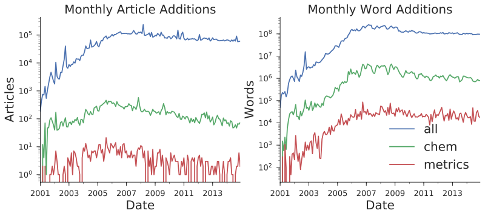

Each of the three time series show very similar profiles in terms of growth, but at different scales. Chemistry is a much more prominent field than econometrics, as can be seen by the 10x-100x higher numbers of articles and words being added each month.

Generally speaking, new Wikipedia articles start out quite small and grow slowly over time. Roughly 70% of articles are less than 20 words long upon creation, reflecting the fact that many article begin as a "stub" — a short article, perhaps just a title and single descriptive sentence, that is intended to be built upon in the future. @[edit_example] shows an example of an early edit of the Magnesium Sulfate stub, where new additions are underlined aneletions are struck through.

@! [edit_example] Example of the early editing on the Magnesium Sulfate article.
"Magnesium sulfate ," MgSO4, (commonly known as called" Epsom salts  salt" in hydrated form) is used as a therapeutic bath a chemical compound with formula MgSO4,
Epsom salt was originally prepared by boiling down mineral waters at Epsom, England and afterwards prepared from sea water. In more recent times, these salts are obtained from certain minerals such as siliceous hydrate of magnesia.

@[entry_size_dist] plots the size distribution of newly created articles that are longer than 20 words. Here we can see that the bulk of articles begin at less than 200 words. There is some mass in the tails of the distribution, though this may be due to the renaming or reallocation of large existing articles.

@! [entry_size_dist] Size distribution of new articles longer than 20 words
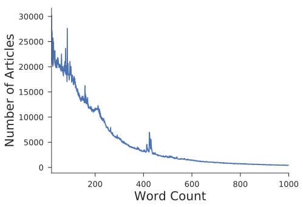

In @[field_hist] there was some evidence of tapering off in the number of chemistry and econometrics articles being created. This is likely because many of the most important topics in these fields has already been added. @[age_size_profile] shows corroborative evidence of this by plotting how articles grow on average. Interestingly, all three cohorts average approximately 250 words when first written. Article lengths expand significantly after this, but particularly so for the earlier cohort — again suggesting that early Wikipedia articles were on broader, more important topics.

@! [age_size_profile] Average size of articles conditional on age (daily)
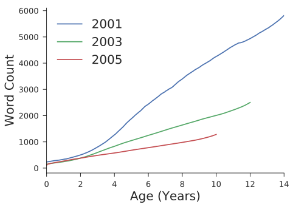

Finally, in @[size_dist] we present the current distribution of article size conditional on being larger than 30 words. Here we see the characteristic long tail extending nearly linearly in log-log space. There are also a large number of articles with very few words. We exclude such "stub" articles from our analysis by imposing a minimum of 500 characters in each article for inclusion in our sample.

@! [size_dist] Distribution of article size for articles larger than 30 words
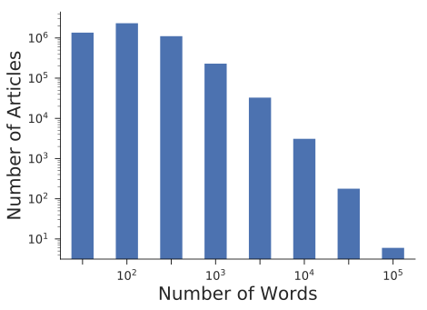

### Word Coverage

For our word-level analysis we focus on the Top 90% most common unique words in the scientific journals. The entire vocabulary that we could potentially use contains ~1.2M words, of which we focus on the most-used ~1.1M in science. This serves two purposes: (1) it eliminates noise from words with single digit frequencies (and thus where there are large proportional swings in usage), and (2) it avoids issues arising from errors in parsing, non-content strings (such as URLs), and misspellings in the source text. It should be noted that this set of words will include very common ones such as "the" and "a." In subsequent analysis, we use inverse document frequency weighting, which ensures that our results are not being driven by these words. Even after such a cull, the words represented here account for 99% of word usage in science and 72% of word usage in the Chemistry pages of Wikipedia.

We can also consider the overlap in the two vocabularies. We see that they are similar, but also have substantial differences. About 61% of the words in the scientific literature appear in Wikipedia, while amongst the set of words appearing in Wikipedia, about 63% appear in science. The following provides some context for the relative frequency of the words in our data:

@| [word_ranks] Comparison of word usage between Wikipedia and scientific literature
| Word | Literature Rank | Wikipedia Rank |
|------|-----------------|----------------|
| Acid | 59 | 65 |
| Reaction | 32 | 132 |
| Graphene | 2,143 | 3,099 |
| Photovoltaic | 5,764 | 7,651 |
| Gravity | 6,139 | 2,375 |
| Pokemon | 745,676 | 14,485 |

### Scientific Fields in Wikipedia

We are interested in investigating the effects that a Wikipedia article has on the corresponding areas in the scientific literature. Doing this requires assigning Wikipedia articles into scientific fields, which is not a trivial undertaking. Our first step is to take advantage of a user-generated categorization scheme, in which editors can tag articles with a particular category, to generate a hierarchical relationship between articles. This induces a category tree. ^[ Surprisingly, this is in fact a cyclic graph. However, it can be pared down to a tree using a small number of edge deletions. In particular, we calculate the PageRank of each node (category) in this graph and eliminate edges from low PageRank nodes to high PageRank nodes. This eliminates only 1% of nodes and renders the graph acyclic (a tree).] To generate a list of articles in a particular field, we simply look at the top level category (say, Chemistry), find all of its descendant subcategories, then find all pages belonging to such categories.

Unfortunately, this pulls in a large number of false positives. For example, following the hierarchy from Chemistry yields: Chemistry > Laboratory Techniques > Distillation > Distilleries > Yerevan Brandy Company (an Armenian cognac producer).

To correct for false positives, we hand classify a set of 500 articles and use these to train a support vector machine (SVM) classifier. The SVM maps vectors of word frequencies into a binary classification (in the field or not). The SVM is standard technique in machine learning for tackling high dimensional classification problems such as this one. In the case of chemistry, this process narrows the set of 158,000 potential articles to 27,000 likely chemistry articles in Wikipedia.

## Scientific Literature

The data on the scientific literature is provided by Elsevier publishing company and includes *the full text* of articles published in their journals. This is useful for us, since it allows us to look for the words used in the scientific literature and whether they reflect those used in Wikipedia.

In addition, we make use of the article metadata provided, such as author and publication date. The entire dataset includes 2,061 journals over many years. Since we are interested in the interaction of the scientific literature with Wikipedia, we use only data from 2000 onward.

For each article, we observe the journal that it is published in, the year of publication, the journal volume and issue numbers, the title and author of the article, and the full text. We don't make use of any image data representing figures or charts, and equations, since our analysis is word-based. Finally, since journal publication time is often poorly documented (saying, for example, "Spring 2009"), we hand collect this info at the journal issue level for the journals we use.

Focusing specifically on the chemistry literature, which we examine in particular detail, we look at 50 of the highest impact journals, constituting 745,000 articles. Of these, we focus on the 326,000 that are from after 2000.

## Web of Science Citation Data

The data on academic citations is provided by Web of Science. It provides directional links, indicating which papers cite which other ones. This information is also aggregated to provide total yearly citation counts for each paper.

# Observational Analysis Methodology

The purpose of this first analysis is to establish the broad correlations between word usage in Wikipedia and word usage in the scientific literature. The intent in this section is *not* to establish causation, but rather to observe in general how contemporaneous these changes are across many different areas in Wikipedia. In @[new_wiki] and @[experimental_results], we assess how much of these effects are attributable to a causal effect of Wikipedia on Science.

## Word Co-occurrence

### Documents

In addition to analyzing the usage of individual words, we also take advantage of their arrangement into documents in both corpora. Given a certain set of possible words (a vocabulary) of size $K$, each document can be represented by a $K$ dimensional vector in which each entry denotes the number of appearances of a particular word. This is referred to as a bag-of-words model, because information on word positions within the text are discarded. These vectors are generally extremely sparse, since only a small number of words are represented in any document.

We can now define the cosine similarity metric between two documents with vectors ${v}_{1}$ and ${v}_{2}$ as

$$ d({v}_{1},{v}_{2})=\sqrt{\frac{v_1 \cdot v_2}{\|v_1\|\ \|v_2\|}}

where $\|v\|=\sqrt{v_1 \cdot v_2}$. This satisfies the natural properties that: (1) $d({v}_{1},{v}_{2}){\in}[0,1]$; (2) $d(v,v)=1$, and (3) $d({v}_{1},{v}_{2})=0$ when ${v}_{1}$ and ${v}_{2}$ have non-overlapping bases.

To account for the fact that some words carry more meaning than others, we utilize term frequency-inverse document frequency (tf-idf) weighting to inflate the relative weight given to rarer (and presumably more important) words. In particular, this scheme weights tokens by the inverse of the fraction of all documents that the token appears in. This is a standard metric used text analysis problems.

Most articles in the scientific literature are not that similar to any given Wikipedia article. @[similarity_distribution] shows this empirically, plotting the average similarity between all pairs of Wikipedia and scientific articles in our Chemistry sample.

@! [similarity_distribution] Density of similarity between Wikipedia and scientific articles (all pairs shown)
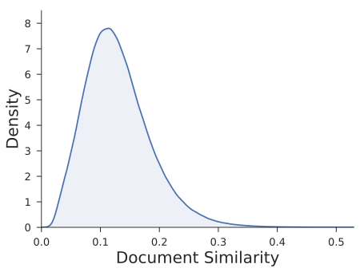

To estimate the effect of Wikipedia on Science from our observational data requires two elements: an observed correlation between Wikipedia and the change in language use in the scientific literature (raw effect), and a counterfactual about how word usage would have changed absent the Wikipedia article. We calculate the latter first, by considering language drift.

### Language Drift

Over time, the usage of words in scientific writing naturally varies. Sometimes this is due to non-fundamental changes in terminology, and other times this is due to the advent of genuinely new concepts or discoveries, such as the "CRISPR" gene-editing technique in biology. In order to assess the relationship between science and Wikipedia at the document level, we must first characterize what we call the baseline "drift" of word usage frequency.

To accomplish this, we track word usage frequencies in science over time and characterize their evolution. That is, we calculate the probability of a word moving from a particular frequency ${f}_{t}$ one year to another potentially different frequency ${f}_{t+1}$ the next year. In practice, we group words into very finely spaced frequency bins in each year and calculate their Markov transition matrix. We do this without any dependence on the Wikipedia data.

Once we've accomplished this, we can then simulate large numbers of documents to see what it implies for the evolution of document similarities. Specifically, starting at a given time period $t$, we simulate a large batch of documents using word frequencies from science and Wikipedia. ^[We assume no correlation between words within documents. In reality, of course, this is not the case. However, entertaining more elaborate theories of synthetic document generation is beyond the scope of this paper and would not greatly enhance the quality of the results.] We then generate a new word frequency vector for period $t+1$ using the aforementioned Markov matrix. Finally, we use this vector to generate a sample of new science articles.

@! [simulated_similarity_drift] Simulated drift in science-Wikipedia document similarity
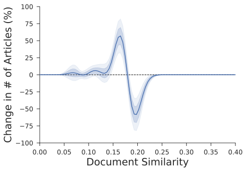

As this shows, there is a natural drift ($\delta $ away from the language of previous articles, resulting in lower document similarity as time passes. On average, this effect is a reduction in similarity of 0.074% over the same time period as we will measure the treatment effect (described below, roughly nine months). The biggest effects are from a fall in the number of documents at similarity 0.2 - 0.3 down to a level of 0.1 - 0.2. The distribution provided by this drift analysis provides a baseline against which we can measure the raw observational correlation associated with adding a Wikipedia article.

### Specifications

We calculate the (raw) effect of adding a Wikipedia article using a regression approach. Let us denote the cosine similarity between Wikipedia article $i$ and scientific article $j$ at time $t$ as ${d}_{\mathit{ijt}}$. This notational will include all articles pairs, even those where the scientific article was published before the Wikipedia article. Thus, let us also denote by ${w}_{\mathit{ijt}}$ the binary indicator of whether scientific article $j$ was written after Wikipedia article $i$.

With our notation defined, we can state the precise specification we use.

$$ {d}_{\mathit{ijt}} \sim \alpha +\tau \ast {w}_{\mathit{ijt}}

This is essentially a difference in means.

With estimates of both the raw treatment effect, $\tau $, and the counterfactual drift tendency, the net effect of adding a Wikipedia article can be calculated as: $\omega = \tau -\delta $.

## Measurement Timeline

In order to examine the relationship between Wikipedia and science, we look at scientific articles shortly before and shortly after the appearance of new Wikipedia article. Our hypothesis is that if Wikipedia has an impact on the progression of the literature, science published after the creation of the Wikipedia article will bear a closer similarity to the article than the science published before it did.

We consider an article to have been "created" three months after its first appearance. We impose this delay to reflect a common article creation sequence in Wikipedia wherein someone (such as an editor) indicates that a new page *should* be written and creates a placeholder for it (a "stub"), after which subsequent edits are made to fill in the page. Such stubs are a prevalent phenomenon on Wikipedia (Shafee et al., 2016), and absent this choice we would have a large number of articles "created" with almost no content. ^[An example of a newly-created article with almost no content can be seen at [here](https://en.wikipedia.org/wiki/Paracamelus), as of April 2017.]

We look for effects of the Wikipedia article on science at two time windows around article creation, one six-month window preceding it and one six-month window starting three months after it. The latter delay also accounts for publication lags in science. The following diagram explains this:

@! [timing_diagram] Measurement timeline
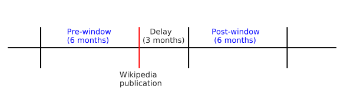

For each Wikipedia article, there is a certain set of scientific articles associated with the pre and post windows, respectively. This induces a distribution of similarities (pre and post) for each Wikipedia article. In our analysis, we look at the average difference between these pre and post distributions. If the post distribution shifts closer to the Wikipedia article, it suggests an increased correlation between Wikipedia and the scientific articles.

# Observational Analysis Results

## Overall correlations

@[freq_scatter] plots the log frequencies of tokens with above median frequency in both Wikipedia and science. The red line shows an OLS regression fit, indicating a strong positive correlation.

@! [freq_scatter] Token frequencies in Wikipedia and Science (above median tokens)
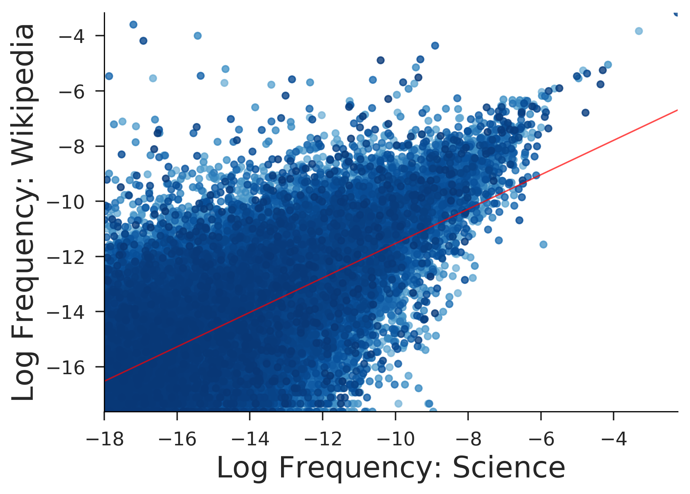

Here we can see that there is a rather strong relationship between the relative frequencies of words in the two corpora. Nonetheless, there are considerable difference in usage frequencies at all levels.

## Event studies

Below are some examples of token frequency time series in the present vocabulary. Each is shown starting from 2001, when Wikipedia started, until nearly the present day. From these we can see that there is certainly some correlation between the respective Wikipedia and science series, at least in levels.

@! [sample_freqs] Sample token frequency time series in Chemistry
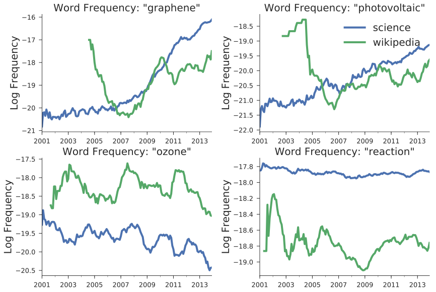

Naturally, coverage in Wikipedia does not always begin immediately, but for most tokens coverage begins between 2005 and 2007. In terms of trends, it is quite common to see a large amount of editing activity near when the token is first introduced, as a main article is built up, followed by a reduction. After this, there may or may not be future increases, presumably depending on whether the term enjoys more relevance to research in the future.

We explore the co-occurrence of words in the two corpora in greater detail in Appendix B.

## [new_wiki] New Wikipedia Articles

In this section we analyze how similar the scientific literature is to Wikipedia articles when they are created. Our hypothesis being that the scientific literature *after* the Wikipedia article will be more similar to it that the scientific literature *before*.

We first look at the raw average effect — are scientific articles published after the Wikipedia article more similar to it?

@| [wikipedia_creation_regression] Observational Effect of new Wikipedia Article (not accounting for language drift)
| | Similarity |
| - | - | - |
| Intercept | $0.1309$\*\*\* ($0.0005$) |
| After | $0.0014$\*\*\* ($0.0003$) |
| N | $705104$ |
| $R^2$ | $0.0002$ |
| Adjusted $R^2$ | $0.0002$ |
| F Statistic | $108.2406$ |
*Note:* \*$p < 0.1$; \*\*$p < 0.05$; \*\*\*$p < 0.01$

The coefficient on "After" in the regression confirms that articles published afterwards are indeed more similar, and that this difference is statistically significant

Having observed the average effect, we now examine the distributional changes in similarity. This approach closely mimics that used (later) in our analysis of the experimental effect, and hence also provides a useful point of comparison for that discussion.

To assess the magnitude of differences between the pre- and post-article windows, we look at the density over the similarity metric between the Wikipedia article and its associated in-window scientific article, pooling over all Wikipedia articles. We then look at the difference in density between pre and post windows. Because both pre and post are densities, this differential must integrate to zero, reflecting where the relative densities have risen and fallen.

@! [observational_effect_diff] Evolution of the similarity between Wikipedia and science after a new Wikipedia article (absolute change in density), not accounting for language drift
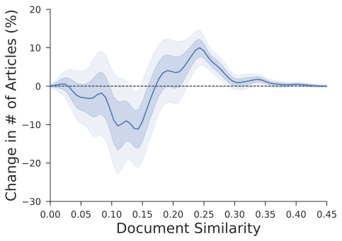

We can see in @[observational_effect_diff] the shift from the lower similarity levels between 0.1 and 0.2 to higher levels, namely those above 0.2. ^[These effects are similar if other window sizes are used] What may not be as clear from this plot is the proportional size of these changes. Finding similarity levels above 0.3 is relatively rare, meaning the increases in the right tail of this graph is a meaningful increase. @[observational_effect_growth] reflects this, showing the proportional change at each level of similarity.

@! [observational_effect_growth] Proportional change in density of similarity between pre and post windows, not accounting for language drift
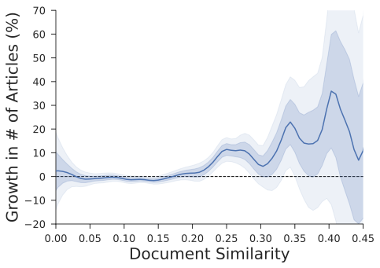

Recall that the estimate from @[wikipedia_creation_regression] represents only the raw effect, of 0.11%. This effect needs to be contrasted with the counterfactual drift value calculated in 5.1.2 of 0.07%. Thus we get a correlational effect of $\omega =0.11\%-(-0.07\%)=0.18\%$. Our experimental setup, presented next, will not require this drift adjustment because the control group can be used directly as the counterfactual.

Although the correlations presented in this section are suggestive, they are not causal. It is possible that they represent an effect that Wikipedia is having on the scientific literature. But such effects are indistinguishable from another causal pathway, new scientific topics generating a Wikipedia article and more follow-on work.  Separating these two effects requires turning to our experimental results.

# [experimental_design] Experimental Design

From 2013-2016 we ran an experiment to ascertain the *causal* impact of Wikipedia on academic science. New scientific articles were written by PhD students in those areas. Half of those articles were uploaded to Wikipedia, while half were held back. ^[At the end of the experiment, these were also uploaded to Wikipedia to deepen the knowledge available to the public.] We then considered the differential impact that adding these articles to Wikipedia had on the scientific literature.

The experiment was run in two waves, first a wave in Chemistry (January 2015 - 43 articles created) and then in Econometrics (November 2015 - 45 articles created). The main text of this article concerns only the Chemistry wave. It turns out that the rest of the world was less excited by econometrics than the authors of this paper, and so the average views of the Chemistry articles were more than thirty times those of the Econometrics pages! With so few views by the Econometrics community the second experimental wave is underpowered and thus we do not discuss it here (although for the sake of full disclosure, we do report additional details in Appendix A.

## Article Creation

To create the Wikipedia articles for this experiment we followed the following process:

1. Generate a list of potential Wikipedia article topics of science from textbooks or course syllabi from leading universities
2. Have subject experts check whether the potential topics were already present in existing Wikipedia pages
3. Commission subject experts to create new articles for the topics not already covered in Wikipedia

Using personal connections and online research we located textbooks and course syllabi for upper-level undergraduate and introductory graduate level classes from several prominent universities (Harvard, MIT, Berkeley, and Cambridge). PhD students in Chemistry then reviewed Wikipedia to see if those topics were already covered. We found that the following percentage of topics from these textbooks / syllabi were already represented:

@| [topic_coverage] Wikipedia coverage of science
| Chemistry Topics in Wikipedia | |
| - | - |
| Upper-level undergraduate | $600 / 646 (93\%)$ |
| Graduate — Masters level | $64 / 136 (47\%)$ |

Because we are interested in the effect of future deepening of the scientific content on Wikipedia, we focused the experiment on the graduate level topics — which represent nearly all the opportunity for new scientific Wikipedia articles.

Within these potential articles, there were differences in the breadth of applicability: some represented a topic on their own, while others only covered a narrow aspect of a topic. We focused on broader topics since our journal-level analysis was also broad-based. ^[We have no reason to believe that the effect from narrower topics would be smaller, just that they would manifest in a narrower set of scientific articles — which would be challenging to identify ahead of time.] Here are some examples of the graduate articles that were identified as missing from Wikipedia and which we targeted for article creation:

@| [example_articles] Examples of New Wikipedia Articles Created
| Chemistry |
| - |
| Synthesis of Hydrastine |
| Multiple Michael/Aldol Reaction |
| Reagent control: chiral electrophiles |

PhD students with expertise in these fields then drafted articles on these topics, basing them both on their own knowledge and research conducted during writing.

In total, 43 new Chemistry articles were written for this experiment. These articles then became the "at-risk" set for being randomized into treatment and thus uploaded to Wikipedia.

As we did with the observational analysis, we can characterize the distance between these articles and articles in the scientific literature using cosine similarity. We find the following distribution of similarities:

@! [similarity_distribution_experiment] Density of similarity metric for all pairs of experimental Wikipedia and scientific articles
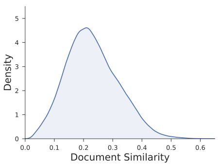

The document similarities shown for the experimental article in @[similarity_distribution_experiment] are noticeably higher than those from the observational analysis shown in @[similarity_distribution]. This suggests that our experimental articles are much closer to the frontier of knowledge than many historical Wikipedia articles. This makes sense as many early Wikipedia Chemistry articles are likely to be on broad, introductory topics that are unlikely to be the focus of a modern Chemistry scientific article, whereas the experimental articles are on graduate topics in Chemistry. This will, however, have the implication that the observational and experimental estimates for the effect of Wikipedia are not directly comparable.

## Article Stratification and Randomization

To maximize the statistical power of the experiment, we stratified the at-risk set of articles with a block randomized design. We stratified on the following:

- Article Author — to control for differences in topic area / article quality / article readability
- Branch of knowledge (e.g. Organic vs. Inorganic Chemistry)
- Types of topics (e.g. general chemical principles vs specific reactions)

Within this block design we did complete randomization, assigning 50% (or the nearest integer) to treatment and 50% to control. To ensure that our randomization has yielded covariate balance, we compared the following characteristics of the treatment and control groups:

- \# words in the article
- \# links in the article
- \# figures in the article
- \# academic references cited in the article
- \# non-academic references cited in the article
- \# of web-of-science articles written on that topic
- \# of google hits when searching for that topic

The following tests show the balance using both a t-test (comparing differences in means) and a Kolmogorov-Smirnov test (comparing for differences in distribution):

@| [covariate_balance] Covariate Balance
| | Treatment (mean) | Control (mean) | T-test (p-value) | KS-test (p-value) |
| - | - | - | - | - |
| \# words | 241 | 243 | 0.47 | 0.16 |
| \# links | 11.1 | 10.9 | 0.82 | 0.99 |
| \# figures | 1.9 | 1.9 | 0.98 | 1.00 |
| \# academic refs | 3.0 | 2.4 | 0.26 | 0.99 |
| \# non-academic refs | 0.0 | 0.2 | 0.10 | 0.98 |
| \# web-of-science articles | 858 | 1934 | 0.52 | 0.74 |
| \# google hits (million) | 1.9 | 4.3 | 0.32 | 0.08\* |

As @[covariate_balance] shows, the covariate balance is excellent, for both sets of articles, particularly on variables that pertain to the article itself (\# words, \# links, \# academic / non-academic references). This mitigates concerns of selection effects biasing our results. Our articles lengths are also very consistent with those of an average article, ~250 words, as discussed in 4.1.1.

## Implementation

The treatment articles were uploaded to Wikipedia in January 2015. ^[One article was uploaded earlier, in September 2014 as a pilot to test the review process.] All the articles were initially uploaded as unique pages. After this point, the self-governing, open-source nature of Wikipedia became important for these articles.  Based on the editors views these articles were variously (i) accepted, (ii) rejected for rewriting (e.g. for being too technical), (iii) added as sub-sections of other pages. Rejected articles were revised in light of the editor's comments and then re-submitted.

Because the Wikipedia editor intervention happened after the randomization, it only applied to treatment articles, and thus it is impossible to establish the counter-factual effect that editor intervention would have had on the control articles. As a result, we estimate our effects as an intent-to-treat — that is, we consider the timing and article content to be that from the initial upload. We do not include any changes due to the editors or our revisions based on editor comments.

These articles (or the page that they were added to) received an enormous amount of interest, with each article averaging over 4,400 views *per month* since they were uploaded. In total, by February 2017 the pages from the experiment had accumulated over 2 million views. This makes it plausible that in the causal chain of interest to us (new Wikipedia article $\rightarrow$ scientists reading the articles $\rightarrow $ effect on the scientific literature) is sufficiently strong for our treatment articles to have an impact on the scientific literature.

Data on the content of the scientific literature through November 2016 was then used to look for impacts from the treatment articles.

## Outcome Measures

To interpret the experimental results, we perform the same analysis as in the observational section. In particular, we construct pre and post windows around the creation of each Wikipedia article and compare document similarity before and after.

In contrast to the observational analysis, where we needed to simulate language drift, the presence of the control group (with excellent covariate balance and only random differences) allows for much more precise measurement of the counter-factual. As such, it is possible to directly compare the results from the treatment and control groups and ascribe the difference to a *causal* effect.

# [experimental_results] Experimental Results

## Causal Effect of Adding a Wikipedia Article

Recall that our estimator for the treatment effect is a difference in differences, comparing the similarity of articles in the scientific literature after the Wikipedia articles, as compared to beforehand (first difference), and then comparing across treatment and control (second difference). Before showing the net effect, we present the first differences for each of treatment and control in @[experimental_effect_split].

@! [experimental_effect_split] Treatment and Control proportional density differentials
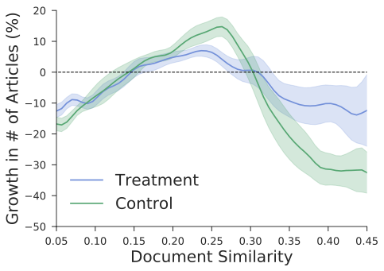

Here we can see that there is a sizeable difference between the treatment and control response. For example, the control group has a peak between 0.20 and 0.25, reflecting that the share of scientific articles with cosine similarities to the Wikipedia articles between those values *rose* from the pre- to the post-period, increasing roughly 5%. The dips to the left and right show where the proportional losses were, from highly similar articles (0.3+) and to a lesser extent from articles with low similarity (<0.15).  Since the control articles were not actually uploaded to Wikipedia, this distribution represents the baseline of change in the scientific literature — i.e. the natural evolution in the topics covered and words used in them.

The treatment group shows a broadly similar pattern, but with notably different magnitudes, with much less of a drop in the highly similar articles. This analysis can be seen more clearly by looking only at the difference in the estimates (i.e. normalizing by the baseline represented by the control articles).

@! [experimental_effect] Effect of treatment on scientific article similarity to Wikipedia (the shaded areas indicate 1 and 2 standard errors, respectively)
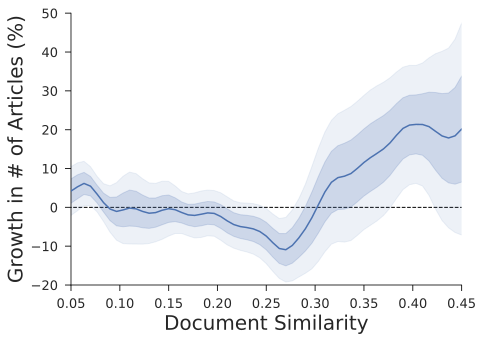

@[experimental_effect] shows that the effect is concentrated in the high similarity region, as was true in the observational analysis.

Having presented our results visually, we now present them in regression framework. It is important to note that running a simple OLS regression will not be sufficient to calculate the standard errors correctly as all data are dyadic: one Wikipedia article to one scientific literature article. This implies strong correlations between errors. To account for this, we use a two-way cluster robust estimator (@[cameron-dyadic]) to calculate the (dyadic) standard errors for the mean effects. We bootstrap the standard errors for our quantile regressions.

@| [experimental_results_table] Experimental Results
| | Similarity (OLS) | Similarity (q=25%) | Similarity (q=50%) | Similarity (q=75%) |
| - | - | -  - | -  - | -  - | - |
| Intercept | $0.2237$\*\*\* ($0.0089$) | $0.1601$\*\*\* ($0.0094$) | $0.2149$\*\*\* ($0.0102$) | $0.2811$\*\*\* ($0.0126$) |
| Treated | $-0.0049$ ($0.0118$) | $-0.0030$ ($0.0122$) | $-0.0045$ ($0.0135$) | $-0.0102$ ($0.0170$) |
| After | $-0.0041$\*\*\* ($0.0003$) | $0.0027$\*\*\* ($0.0009$) | $-0.0007$ ($0.0008$) | $-0.0114$\*\*\* ($0.0014$) |
| Treated x After | $0.0033$\*\*\* ($0.0011$) | $0.0002$ ($0.0013$) | $0.0011$ ($0.0015$) | $0.0072$\*\* ($0.0028$) |
| N | $664790$ | $664790$ | $664790$ | $664790$ |
| $R^2$ | $0.0006$ |  |  |  |
| Adjusted $R^2$ | $0.0006$ |  |  |  |
| F Statistic | $124.1791$ |  |  |  |
*Note:* \*$p < 0.1$; \*\*$p < 0.05$; \*\*\*$p < 0.01$

@[experimental_results_table] shows that, on average, articles have a cosine similarity to the potential Wikipedia articles in our sample of 0.2237, and that posting the article increases this by 0.0033\*\*\*. This effect is a change in the cosine similarity, which is difficult to interpret. However, simulations that we have done suggests that for small changes this moves almost one-for-one with the fraction of meaningful words changed in a document. That is, we find that on average the presence of a Wikipedia article changes 0.33% (or about 1 in 300) of the meaningful words in the scientific article.

As @[experimental_effect] showed, the treatment effect is concentrated in a smaller number of highly similar articles, where the effect is substantially larger. @[experimental_results_table] also shows this in regression form, with quantile regressions at the 25th, 50th, and 75th percentiles. It shows that for the least impacted 25th percentile of articles there is no statistically significant effect, whereas at the 50th
percentile the effect rises to a statistically-insignificant 0.11%, and at the 75th percentile the effect rises to a highly-significant 0.72%.

This naturally raises the question, who is being affected by these Wikipedia articles. For example, are these articles influencing those at the cutting-edge who are publishing in the top journals, or those doing follow-on work?

To test this, we disaggregate the treatment effect by the quality of the journal in which the scientific research is published, diving the 50 journals of our sample into 4 quartiles based on the average impact factor of the journal.

@! [impact_regression] Effect of Wikipedia by Journal Quality

We interpret this as supporting the earlier hypothesis, that new Wikipedia articles created from cutting-edge science become a pathway for others to learn about those ideas. That is, Wikipedia disseminates knowledge. @[impact_results] presents this in regression format.

@| [impact_results] Experimental Treatment Results, by Journal Impact Factor Quartile
| | Quartile 1 | Quartile 2 | Quartile 3 | Quartile 4 |
| - | - | -  - | -  - | -  - | - |
| Intercept | $0.2515$\*\*\* ($0.0102$) | $0.2121$\*\*\* ($0.0080$) | $0.2399$\*\*\* ($0.0102$) | $0.1987$\*\*\* ($0.0079$) |
| Treated | $-0.0084$ ($0.0140$) | $-0.0054$ ($0.0111$) | $-0.0019$ ($0.0131$) | $-0.0031$ ($0.0103$) |
| After | $-0.0245$\*\*\* ($0.0007$) | $-0.0114$\*\*\* ($0.0006$) | $0.0104$\*\*\* ($0.0007$) | $0.0025$\*\*\* ($0.0005$) |
| Treated x After | $0.0066$\*\*\* ($0.0022$) | $0.0052$\*\*\* ($0.0016$) | $0.0004$ ($0.0028$) | $0.0004$ ($0.0013$) |
| N | $128141$ | $115868$ | $187698$ | $233083$ |
| $R^2$ | $0.0143$ | $0.0029$ | $0.0034$ | $0.0008$ |
| Adjusted $R^2$ | $0.0143$ | $0.0029$ | $0.0033$ | $0.0008$ |
| F Statistic | $619.6055$ | $113.2289$ | $211.0366$ | $63.6623$ |
*Note:* \*$p < 0.1$; \*\*$p < 0.05$; \*\*\*$p < 0.01$

Our results indicate that Wikipedia articles *causally* affect the content of scientific articles. But is this influence a positive effect? Revealed preference suggests "yes". Authors choosing to use the Wikipedia information suggests that they deem the Wikipedia information to be "better" in some way. This could be because the information is of higher quality, because it is more easily accessible, or because it is easier to understand. In any case, revealed preference suggests that the scientists view it as preferable.

Notwithstanding this revealed preference argument, as a public policy matter we might want to know if the usage of the Wikipedia information improves (or harms) the quality or influence of scientific articles that use it. To evaluate this question, we compare the academic citations that accrue to two sets of articles published after our experimental intervention: one "related" to the treatment group and one "related" to the control group. Here "related" is subjective, since the effect we observe is statistical; we can't ascribe any single paper as being influenced by Wikipedia, only that on average they are. We find no evidence that Wikipedia-influenced articles accrue either more or less citations that non-Wikipedia influenced ones.

## Indirect Citation Effects

As already mentioned, @[wiki-cites] find that almost no authors cite Wikipedia directly. Despite this, it is possible that there are other indirect measures that authors leave when referencing Wikipedia. In particular, the academic research listed as a reference in the Wikipedia article might be cited instead of the Wikipedia article itself. This could be because Wikipedia was used to find that article, and then the article itself was read and referenced.  Alternatively, a less charitable interpretation would be that authors cite the underlying work having only read the Wikipedia article.  There is significant potential for this effect, as "Wikipedia is the 6th highest referrer of DOI links (the unique hyperlinks assigned to academic articles)" (AOASG, 2017). Despite the plausibility of this mechanism, we find no empirical support for it in our experiment.

## Distributional Effects

One might imagine that public repositories of knowledge would be particularly valuable to those with less access to non-public repositories, in this case those with less access to formal journals.  We proxy for this by considering the GDP per capita of the modal home country of the scientific authors — assuming that those with lower GDP will have less access. We then recalculate our treatment effect separately, running one regression for each quartile of the GDP per capita country distribution. Our results are presented in @[gdp_results].

@| [gdp_results] Experimental Results (Distributional Effects)
| | Quartile 1 | Quartile 2 | Quartile 3 | Quartile 4 |
| - | - | -  - | -  - | -  - | - |
| Intercept | $0.2162$\*\*\* ($0.0087$) | $0.2447$\*\*\* ($0.0098$) | $0.2298$\*\*\* ($0.0090$) | $0.2237$\*\*\* ($0.0090$) |
| Treated | $-0.0029$ ($0.0116$) | $-0.0083$ ($0.0135$) | $-0.0058$ ($0.0121$) | $-0.0043$ ($0.0118$) |
| After | $-0.0035$\*\*\* ($0.0013$) | $-0.0225$\*\*\* ($0.0008$) | $-0.0041$\*\*\* ($0.0004$) | $-0.0029$\*\*\* ($0.0003$) |
| Treated x After | $0.0005$ ($0.0026$) | $0.0089$\*\*\* ($0.0025$) | $0.0039$\*\*\* ($0.0012$) | $0.0034$\*\* ($0.0014$) |
| N | $4213$ | $46183$ | $288808$ | $277406$ |
| $R^2$ | $0.0008$ | $0.0106$ | $0.0007$ | $0.0003$ |
| Adjusted $R^2$ | $0.0001$ | $0.0106$ | $0.0007$ | $0.0003$ |
| F Statistic | $1.0789$ | $165.4485$ | $71.7938$ | $30.2143$ |
*Note:* \*$p < 0.1$; \*\*$p < 0.05$; \*\*\*$p < 0.01$

We find, as predicted, that the poorer that a country is, the bigger is the treatment effect — with the exception of the poorest quartile of countries, which have almost no publications and where the Wikipedia intervention seems to have no effect. This is presented graphically in @[gdp_regression].

@! [gdp_regression] Effect of Wikipedia across Countries with varying access to other resources

These results suggest that public repositories of knowledge, such as Wikipedia, have an equity-improving effect, disproportionately benefiting those with less access.

# Discussion

When Darwin extoled the importance "general and popular treatises," he wasn't praising their effect on popular understanding, but on "the progress of science". Our results paint a coherent image of how one of the biggest modern repositories of general and popular treatises does this. We find that the vanguard of science, those publishing in top journals, experience a relatively small impact from Wikipedia. This is not surprisingly since new-to-the-world science cannot, by definition, be manifested in Wikipedia articles. But once such discoveries emerge, they get reflected in Wikipedia, which in turn magnifies the dissemination of that work, shaping follow-on research. This effect is particularly strong for those scientists in resource-poor environments that are less likely to have access to traditional scientific information.

We hope that our findings on the effect of Wikipedia for the dissemination of knowledge will be sufficient to motivate scientists to undertake new initiatives to contribute articles and edits to Wikipedia. But as a society we needn't limit ourselves to individual action. Active public policy could encourage the development of these public resources for science. For example, a National Institutes of Health or National Science Foundation grant could require the scientists to make commensurate edits to Wikipedia (or another repository). Alternatively, extra credit might be given on grant applications for those that promote science in this way.  Grants could also be given directly to these scientific repositories to help with their operating costs.

To judge whether such interventions would be welfare-improving, it is important to investigate both the benefits and the costs. For example, if we required grantees to edit / write a Wikipedia article, this initiative would essentially be a tax on their time (or their students'). The key question is how high a tax would be needed, and whether it would be justified by the social benefit of the additional dissemination of knowledge. We consider two approaches for answering these questions, with the disclaimer that both are back-of-the-envelope calculations designed to show orders of magnitude effects. They are not intended to be precise, and they don't need to be to show the policy conclusion.

Consider first a traditional funding approach to these questions.  Currently, the average NIH grant is for \$500,000 for 4.5 years, or ~\$110,000 per year (U.S. Department of Health & Human Services, 2017). If one assumes that such a grant produces one paper every two years, then the approximate cost of producing one such paper is \$220,000. For our research we paid students \$100 per article.  Assuming one Wikipedia article (or equivalent contribution) per research paper, the implicit tax on research would be $(\frac{\$100}{\$220,000})=0.05$. This seems like a relatively small, reasonable number, but a comparison of effectiveness is still lacking.

A second approach asks if the creation of a Wikipedia article is cost effective compared to the small fraction of grant funding that goes to promote the dissemination of knowledge. To do this cost-benefit calculation, we'll assume the cost of such dissemination 1% of a grant (for attending conferences, copy-editing, etc.), although this assumption could be varied significantly without affecting the overall conclusion.

To calculate the benefits, we consider how the dissemination of knowledge influences later research. For this, we want to calculate a measure of how much an average scientific paper influences later ones.  For simplicity, assume that this can be measured accurately by citations (although that won't actually be required for the argument). Then, if our paper generates $N$ citations ^[According to Thomson Reuters, a typical 2000 paper in Chemistry receives ~19 citations over a ten-year period (Times Higher Education, 2011).], we should attribute some fraction of each of those papers, $s$, as influence due to our paper. Thus, our measure for its impact should be $N\ast s$. But what is $s$? If we assume that there are the same number of papers giving and receiving citations, it must be at most $\frac{1}{N}$, because any number larger than that would imply that the contributions of all the papers receiving citations totalled than 100% of the value of all those giving them! ^[In actual practice the number of papers giving and receiving citations are not equal because of the growth of the number of publications over time. But this effect would not materially change our conclusions, so we omit it from our calculations for simplicity.] ^[Of course, multiple pieces of research could influence some particular set of words, but once credit was apportioned, this statement would continue to be true. Similarly, research could provide influence without receiving a citation, but such influence would need to be subtracted from other articles, so again this statement would remain true.] And thus we conclude something which is fairly intuitive: an average paper cannot influence more than $\left(\frac{N\ast {1}}{N}\right)=1$ other papers. We could also represent this effect in words. In our sample the average Chemistry article in our sample has ~3,900 words, and thus 3,900 words of influence is the maximum influence that an article could have. We now have both the cost of disseminating information and the influence is has, and thus we get our (rough) estimate of the cost as $\frac{\$220,000\ast 1}{3,900}=\$0.56$ per word. ^[This number could be an over- or under-estimate for many reasons. It could be an underestimate because NIH-funded work is more important than general work. The number of papers is also rising over time, which would also cause this to be an underestimate. In contrast, it could be an over-estimate because it ignores citations accruing to old work or because (presumably) new works have substantial original content. While these factors could influence the result of our calculation, it is implausible that any of these changes would impact the clear policy conclusion that follows.]

A similar analysis can be done for the influence of the Wikipedia article. Based on the estimates from @[experimental_results], the average change in word frequency from our intervention was ~0.3%, implying an average change of 11.7 words per article. ^[This number is only a rough estimate since our 0.3% effect is calculated using a term frequency-inverse document frequency (TF-IDF) estimate. However we have done simulations to confirm that there is a reasonable equivalency between the two.] Of course, as our quantile estimates suggest, this effect is actually skewed, with a small percentage of articles changed more, and many articles being unchanged.

Since there were 27,000 scientific articles in the test set, an average of 11.7 words changed per article implies that ~316,000 words were changed in total. ^[If we also extrapolated the effect to non-Elsevier journals, this effect would presumably be larger.] Since each Wikipedia article cost \$100 to write, this implies a cost per word of \$0.00032 — or about 1/1700th of the cost of dissemination through traditional methods.

Our back-of-the-envelope analysis thus has stark conclusions: even with many conservative assumptions, dissemination through Wikipedia is ~1700x more cost-effective than traditional dissemination techniques. Thus, from a public policy perspective, funding the creation of content in public repositories of science like Wikipedia is compelling. We thus encourage governments, organizations, and publically-minded individuals to incorporate the creation of such articles into their activities and applaud those who are already advocating it (e.g. Shafee, 2017).

# Conclusion

This paper documents the contribution of public informational good providers, like Wikipedia. Using a randomized control trial we show that the creation of a Wikipedia article leads scientists to use similar words in later scientific work, which we interpret as strong evidence that Wikipedia is promoting the dissemination of science.  Because our work can go beyond correlation to establish causation, we can conclude that Wikipedia doesn't just *reflect* the state of the scientific literature, it helps *shape* it.

In general, the economics of public informational goods like Wikipedia strongly favor their underprovision: incentives are too low, free-riding is rampant, and Arrow's information paradox hinders market or contractual solutions. We therefore examine the case for public policy interventions in this area. We find that the dissemination of Science through Wikipedia is highly cost-effective and that it is equity-improving because it helps those with less access to traditional scientific outlets.

In a very concrete sense, our paper shows that Darwin was right: "general and popular treatises are almost as important for the progress of science as the original work". But we can be more precise. We show that Wikipedia's contribution is not at the cutting edge (where Wikipedia articles don't yet exist), but in the dissemination of such discoveries to scientists doing follow-on work.  And for those doing the follow-on work, the impact is substantial.  It is our hope that by identifying this effect our research will spur increased investment in the development of these public resources to the benefit of scientists and society at large.

#* References

@@ [alexa-ranking]
institution: Alexa
title: The top 500 sites on the web
url: https://www.alexa.com/topsites
note: Accessed Aug 22, 2017

@@ [arrow-invention]
authors: Kenneth J. Arrow
year: 1962
title: Economic Welfare and the Allocation of Resources for Invention
journal: The Rate and Direction of Inventive Activity: Economic and Social Factors

@@ [aoasg]
institution: Australian Open Access Strategy Group
shortname: AOASG
title: Open access medical content and the world's largest encyclopedia
url: https://aoasg.org.au/2017/09/05/open-access-medical-content-and-the-worlds-largest-encyclopedia/
note: Accessed September, 2017

@@ [moser-books]
authors: Barbara Biasi; Petra Moser
title: Effects of Copyrights on Science: Evidence from the WWII Book Republication Program
doi: 10.2139/ssrn.2542879
year: 2017

@@ [cameron-dyadic]
authors: Colin Cameron; Douglas Miller
title: Robust Inferences for Dyadic Data
journal: Presentation at the Winter North American Meetings of the Econometrics Society
year: 2015

@@ [clarivate]
institution: Clarivate Analytics
title: Web of Science
url: http://www.webofknowledge.com
journal: Accessed at various times in 2017

@@ [db-hoovers]
institution: D&B Hoovers
title: Addgene Inc. Revenue and Financial Data
url: http://www.hoovers.com/company-information/cs/revenue-financial.addgene_inc.b801fd5c8243ca53.html

@@ [elsevier]
authors: Elsevier
title: ConSyn database
note: Accessed from 2012-2017

@@ [stern-giants]
authors: Jeffrey Furman; Scott Stern
title: Climbing Atop the Shoulders of Giants: The Impact of Institutions on Cumulative Knowledge Production
journal: American Economic Review
issue: 101
number: 5
pages: 1933-1963
year: 2011

@@ [gallus-wiki]
authors: Jana Gallus
title: Fostering public good contributions with symbolic awards: A large-scale natural field experiment at Wikipedia
journal: Management Science
year: 2016
url: http://pubsonline.informs.org/doi/abs/10.1287/mnsc.2016.2540

@@ [giles-encyclo]
authors: Jim Giles
title: Internet encyclopedias go head to head
journal: Nature
year: 2005
volume: 438
pages: 900-901

@@ [glott-survey]
authors: Ruediger Glott; Philipp Schmidt; Rishab Ghosh
title: Wikipedia Survey – Overview of Results
year: 2010

@@ [greenstein-biased]
authors: Shane Greenstein; Feng Zhu
title: Is Wikipedia Biased?
journal: American Economic Review: Papers and Proceedings
year: May 2012
issue: 102
number: 3
pages: 343-348

@@ [physician-wiki]
authors: Benjamin Hughes; Indra Joshi; Hugh Lemonde; Jonathan Wareham
title: Junior physician's use of Web 2.0 for information seeking and medical education: A qualitative study
journal: International Journal of Medical Informatics
year: 2009
volume: 78
issue: 10
pages: 645-655

@@ [lightman-science]
authors: Bernard Lightman
title: Victorian Popularizers of Science: Designing Nature for New Audiences
journal: University of Chicago Press
year: 2007

@@ [mit-sources]
institution: MIT
title: Citing Electronic Sources
journal: Academic Integrity at MIT: A Handbook for Students
url: https://integrity.mit.edu/handbook/citing-your-sources/citing-electronic-sources

@@ [mmrrc]
institution: Mutant Mouse Resource & Research Centers
shortname: MMRRC
url: https://www.mmrrc.org/

@@ [ncgrp]
institution: National Center for Genetic Resources Preservation
shortname: NCGRP
year: 2005
title: Annual Report

@@ [nih-genome]
institution: National Institutes of Health
shortname: NIH
title: National Human Genome Research Institute Official Website
url: https://www.genome.gov/10001772/

@@ [type-culture]
authors: Diana Morgan
year: 1990
title: American Type Culture Collection Seeks To Expand Research Effort
journal: The Scientist
url: http://www.the-scientist.com/?articles.view/articleNo/11292/title/American-Type-Culture-Collection-Seeks-To-Expand-Research-Effort/

@@ [princeton-sources]
institution: Princeton University
title: When to Cite Sources
journal: Academic Integrity at Princeton
url: https://www.princeton.edu/pr/pub/integrity/pages/cite/

@@ [darwin]
authors: Tim Radford
year: 2008
title: The book that changed the world
journal: The Guardian
url: https://www.theguardian.com/science/2008/feb/09/darwin.bestseller
note: Accessed Feb 8, 2008

@@ [samuelson-public]
authors: Paul Samuelson
year: 1954
title: The Pure Theory of Public Expenditure
journal: The Review of Economics and Statistics

@@ [wiki-model]
authors: Thomas Shafee
year: 2017
title: Wikipedia-integrated publishing: A comparison of two successful models
journal: Working paper

@@ [wiki-academic]
authors: Thomas Shafee; Daniel Mietchen; and Andrew I. Su
year: 2017
title: Academics can help shape Wikipedia
journal: Science
volume: 357
issue: 6351
pages: 557-558

@@ [wiki-medical]
authors: Thomas Shafee; Gwinyai Masukume; Lisa Kipersztok; Diptanshu Das; Mikael Haggstrom; and James Heilman
year: 2016
title: Evolution of Wikipedia's medical content: past, present and future
journal: Journal of Epidemiology & Community Health, Published Online First: 28 August 2017
doi: 10.1136/jech-2016-208601

@@ [suh-editors]
authors: Bongw Suh; Gregorio Convertino; Ed Chi; Peter Pirolli
year: 2009
title: The Singularity is Not Near: Slowing Growth of Wikipedia
journal: WikiSym
doi: 10.1145/1641309.1641322

@@ [times-citations]
institution: Times Higher Education
title: Citation averages, 2000-2010, by fields and years
url: https://www.timeshighereducation.com/news/citation-averages-2000-2010-by-fields-and-years/415643.article
note: Accessed March 31, 2011

@@ [wiki-cites]
authors: Robert Tomaszewski; Karen I. MacDonald
title: A Study of Citations to Wikipedia in Scholarly Publications
year: 2016
journal: Science & Technology Libraries

@@ [nih-research]
institution: U.S. Department of Health & Human Services
shortname: HHS
year: 2017
title: NIH Research Portfolio Online Reporting Tools
url: https://report.nih.gov/fundingfacts/fundingfacts.aspx

@@ [wikipedia]
institution: Wikipedia
year: Various Years
title: Full edit history
url: https://en.wikipedia.org/wiki/Wikipedia:Database_download

@@ [team-production]
authors: Stefan Wuchty; Benjamin Jones; Brian Uzzi
year: 2007
title: The Increasing Dominance of Teams in Production of Knowledge
journal: Science
volume: 316
issue: 1036
doi: 10.1126/science.1136099

#* Appendix

##* [econ_analysis] A Econometrics Article Experiment

The Econometrics wave of the experiment was run in November 2015, with 45 articles randomized into treatment and control. Some examples of topics covered included:

@| [econ_sample_articles] Examples of New Wikipedia Articles Created
| Econometrics |
| - |
| Two-Step M-Estimators |
| Smoothed Maximum Score estimation |
| Truncated Normal Hurdle Model |

We stratified the 45 articles by article-author, and then did complete randomization within those, yielding 50% (to the nearest integer) in treatment and 50% in control. To ensure that randomization produced covariate balance, we compared the following characteristics of the treatment and control groups:

- \# words in the article
- \# links in the article
- \# figures in the article
- \# academic references cited in the article
- \# non-academic references cited in the article
- \# of web-of-science articles written on that topic
- \# of google hits when searching for that topic

The following tests show the balance using both a t-test (comparing differences in means) and a Kolmogorov-Smirnov test (comparing for differences in distribution):

@| [econ_covariate_balance] Covariate Balance for Econometrics Sample
| | Treatment (mean) | Control (mean) | T-test (p-value) | KS-test (p-value) |
| - | - | - | - | - |
| \# words | 439 | 452 | 0.64 | 0.96 |
| \# links | 11.4 | 10.6 | 0.71 | 0.97 |
| \# academic refs | 2.4 | 2.7 | 0.56 | 0.99 |
| \# non-academic refs | 2.3 | 2.6 | 0.50 | 0.95 |
| \# web-of-science articles | 16,782 | 12,582 | 0.82 | 0.99 |
| \# google hits (million) | 33.6 | 23.9 | 0.55 | 0.51 |

As @[econ_covariate_balance] shows, the covariate balance is excellent, for both sets of articles, particularly on variables that pertain to the article itself (\# words, \# links, \# academic / non-academic references).

Unfortunately, the econometrics articles received only ~100 views per month, less than 3% of those received by the Chemistry articles. With so few views, only a tiny fraction of the authors of econometrics articles in the scientific literature could have viewed them, and thus we would expect our experiment to be underpowered. This will also magnify the difference between the intent-to-treat and treatment-on-the-treated estimators, since so few of the authors of the "treatment" articles would have viewed the Wikipedia articles. Thus our estimates should also be closer to zero.

This is indeed what we see, with the large error bars, reflecting our lack of power.

@! [econ_experimental_effect] Treatment Effect Estimates for Econometrics
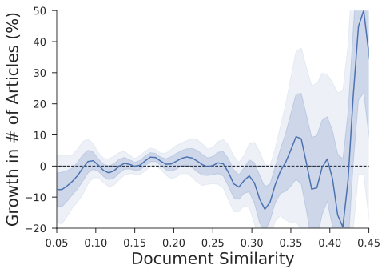

##* [frequency_analysis] B Word Frequency Approach to the Observational Analysis

Instead of analyzing our data at the document level, we could look for frequency changes at the word level. This section describes these results.

###* B.1 Word Frequency

The main object of interest in the text data is the evolution of the usage frequency of various words. In particular, since we seek to uncover the relationship between Wikipedia and the scientific literature, we analyze the parallel evolution of these frequencies in the respective corpora.

In order to make the frequency series arising from these two corpora comparable, we focus on contemporaneous activity. That is, on the scientific literature side, we make the natural choice of looking at the stream of published articles, and for the Wikipedia side, we consider the stream of new words entering the encyclopedia through edits, rather than the state of the text at a particular point in time. ^[Note that this means that the cumulative added word counts will not always exactly reflect the current size of an article as words can be deleted as part of editing, but this more accurately tracks activity in all its forms.] @[frequency_exemplar_simple] shows schematically the hypothesized effect that a Wikipedia article could have on shaping the scientific literature. ^[The frequency of terms in science is assumed to be growing because Wikipedia articles are often written about emerging areas.] Not pictured, but also important, would be effects that reverse the causality or come from common causes (such as development in science).

@! [frequency_exemplar_simple] Schematic of the how Wikipedia might shape science
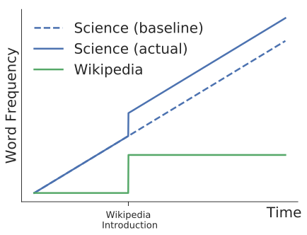

Let ${f}_{i,t}^{\mathit{wiki}}$ and ${f}_{i,t}^{\mathit{sci}}$ denote the relative log frequencies for word (token) $i$ at time $t$ in the Wikipedia and science corpora. ^[Henceforth we will often use this term, from the natural language processing field, to refer to the term we are searching for.] Throughout the analysis, we use relative word frequency to denote the absolute frequency of the word divided by the total frequency in the entire Wikipedia corpus in that period.

Further, for $k{\in}\{\mathit{wiki},\mathit{sci}\}$, define adjacent frequency differences as

$$ {\Delta}{f}_{i,t}^{k}={f}_{i,t}^{k}-{f}_{i,t-1}^{k}

Similarly, let the indicator $I({f}_{i,t}^{k}>0)$ denote whether token $i$ appears in corpus $k$ at time $t$.

We focus on a simple model of word frequencies, where Wikipedia increases total usage of the word above what would be seen absent it. ^[One could also imagine more complicated models where Wikipedia just accelerates progress towards the long-term steady-state. Reliably distinguishing such models would likely take longer observational data (to verify the reaching of the equilibria) and thus we do not consider them here.] Here word frequencies follow the difference equation

$$ [freq_diff_eq] f_{i,t+1}^{\mathit{sci}}=f_{i,t}^{\mathit{sci}}+\alpha (\overline{f}_i^{\mathit{sci}}-f_{i,t}^{\mathit{sci}})+\beta f_{i,t}^{\mathit{wiki}}

where $\overline{f}_i^{\mathit{sci}}$ is the frequency of that token at its "natural potential," that is, the prevalence that it would achieve over the long-run (absent Wikipedia).

Differencing the specification given in @[freq_diff_eq], we find

$$ \Delta f_{i,t+1}^{\mathit{sci}}=(1-\alpha)\Delta f_{i,t}^{\mathit{sci}} + \beta \Delta f_{i,t}^{\mathit{wiki}}

Thus our prime objects of interest in a regression model will be the pure slope persistence of science word frequencies $1-\alpha$ and the effect of Wikipedia occurrence $\beta$.

Motivated by the above model, we perform a number of regression analyses on the word frequency time series, both in levels and in first differences. In addition, we control for levels when looking at first differences to allow for potential deviations from this simple model in how the word diffusion and adoption process works.

###* B.2 Results

We find strong support for linkages between the evolution of word frequencies in Wikipedia and the scientific literature. We focus on the field of chemistry so as to make these results relatable to the observational and experimental analyses at the document level. Using the notation from above, we estimate the following equation

$$ {f}_{i,t+1}^{\mathit{sci}} \sim {f}_{i,t}^{\mathit{sci}}+{f}_{i,t}^{\mathit{wiki}}

As @[log_frequency_regression] shows, in levels, that a 100% increase in Wikipedia frequency is associated with a 7.76% increase in science frequency.

@| [log_frequency_regression] Levels on levels regression of science on Wikipedia
| | Log Science Frequency (t+1) |
| - | - | - |
| Intercept | $-0.1729$\*\*\* ($0.0126$) |
| Log Wikipedia Frequency (t) | $0.0776$\*\*\* ($0.0008$) |
| Log Science Frequency (t) | $0.9167$\*\*\* ($0.0006$) |
| N | $442351$ |
| $R^2$ | $0.9167$ |
| Adjusted $R^2$ | $0.9167$ |
| F Statistic | $2433274.3027$ |
*Note:* \*$p < 0.1$; \*\*$p < 0.05$; \*\*\*$p < 0.01$

A more nuanced analysis recognizes that word frequencies often follow adoption curve like dynamics. Hence the importance of Wikipedia may not be so much on the particular level but on the rate at which new ideas are spread, as proxied by their word usage. We thus estimate the following equation. ^[Importantly, although it has an intuitive appeal, this equation is NOT unbiased because any idiosyncratic error associated with $f_{i,t}^{\mathit{sci}}$ is present on both sides of the regression, and thus will induce some correlation.  However, because of the signs of the terms, this correlation works *against* us observing an effect.]

$$ {\Delta}{f}_{i,t+1}^{\mathit{sci}} \sim {\Delta}{f}_{i,t}^{\mathit{sci}}+{f}_{i,t}^{\mathit{sci}}+{f}_{i,t}^{\mathit{wiki}}

Of particular interest is the coefficient on the Wikipedia frequency level. @[dlog_frequency_regression] summarizes the regression results. Here we can see that a 100% increase in Wikipedia frequency is associated with a 4% increase in the growth rate of the science frequency (recall that all frequencies are in logs).

@| [dlog_frequency_regression] Differences in differences and levels regression of science on Wikipedia
| | $\Delta$ Log Science Frequency (t+1) |
| - | - | - |
| Intercept | $-0.1118$\*\*\* ($0.0114$) |
| Log Wikipedia Frequency (t) | $0.0397$\*\*\* ($0.0008$) |
| $\Delta$ Log Science Frequency (t) | $-0.4407$\*\*\* ($0.0014$) |
| Log Science Frequency (t) | $-0.0436$\*\*\* ($0.0006$) |
| N | $412487$ |
| $R^2$ | $0.2258$ |
| Adjusted $R^2$ | $0.2258$ |
| F Statistic | $40104.7198$ |
*Note:* \*$p < 0.1$; \*\*$p < 0.05$; \*\*\*$p < 0.01$

Since all regressions in log frequencies must condition on positivity, they only pick up the intensive margin of usage. To see the extensive margin, we also run a binary regression on frequency positivity, i.e. whether the word was used in the corpora in that time period.

@| [bin_frequency_regression] Regression of the existence of tokens in science on Wikipedia
| | Science Frequency $>$ 0 (t+1) |
| - | - | - |
| Intercept | $0.1927$\*\*\* ($0.0003$) |
| Wikipedia Frequency $>$ 0 (t) | $0.2261$\*\*\* ($0.0006$) |
| Science Frequency $>$ 0 (t) | $0.4208$\*\*\* ($0.0005$) |
| N | $2836926$ |
| $R^2$ | $0.2733$ |
| Adjusted $R^2$ | $0.2733$ |
| F Statistic | $533535.7131$ |
*Note:* \*$p < 0.1$; \*\*$p < 0.05$; \*\*\*$p < 0.01$

Not surprisingly, we see that the presence of words in each corpus is also correlated.
